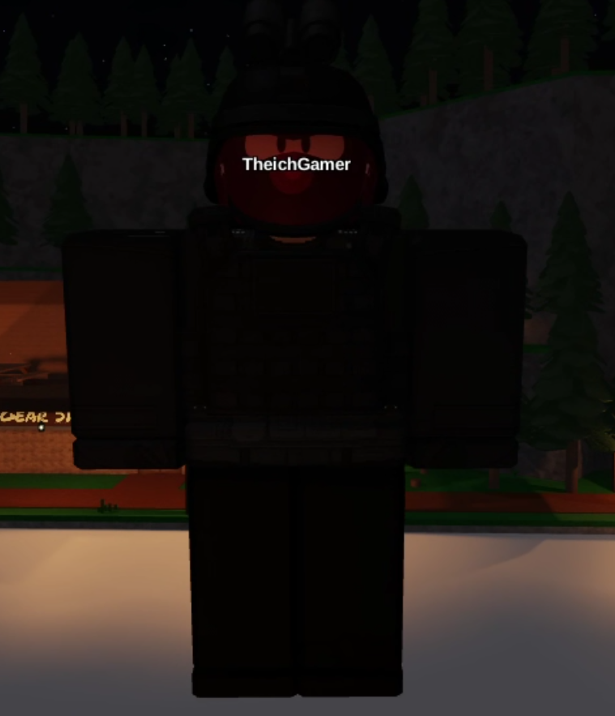

# Team Create With Avatars
Turn Team Create into a more immersive experience by replacing the default "ball and arrow" indicators with full Roblox avatars! 

[Download from Roblox](https://create.roblox.com/store/asset/123901541910696/Team-create-with-avatars)

## Features
 | Displays your avatar instead of the default indicator. This shows for everyone (even people without the plugin)
-|-|

## Installing
Head over to the [GitHub Releases](https://github.com/Sebastian2852/Team-Create-With-Avatars/releases/latest) or to [Roblox Creator Store](https://create.roblox.com/store/asset/123901541910696/Team-create-with-avatars) and download from there.

## Coming
- Make it so you can customize whose avatar the plugin uses